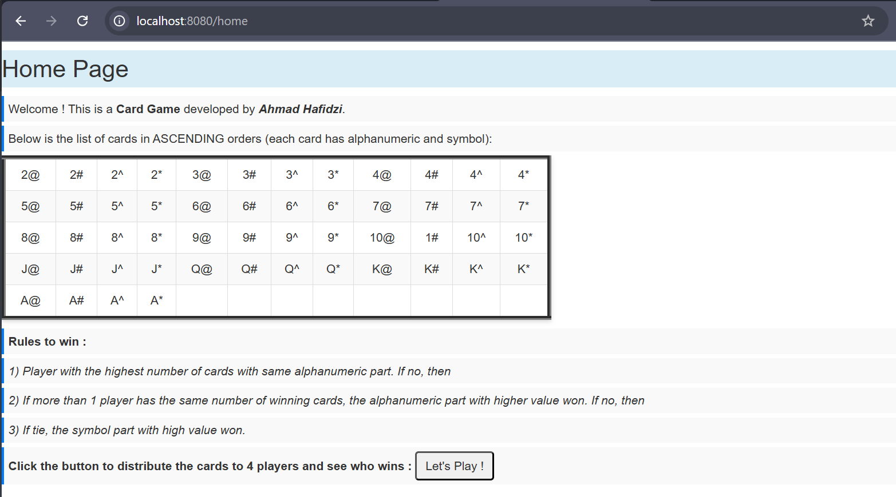
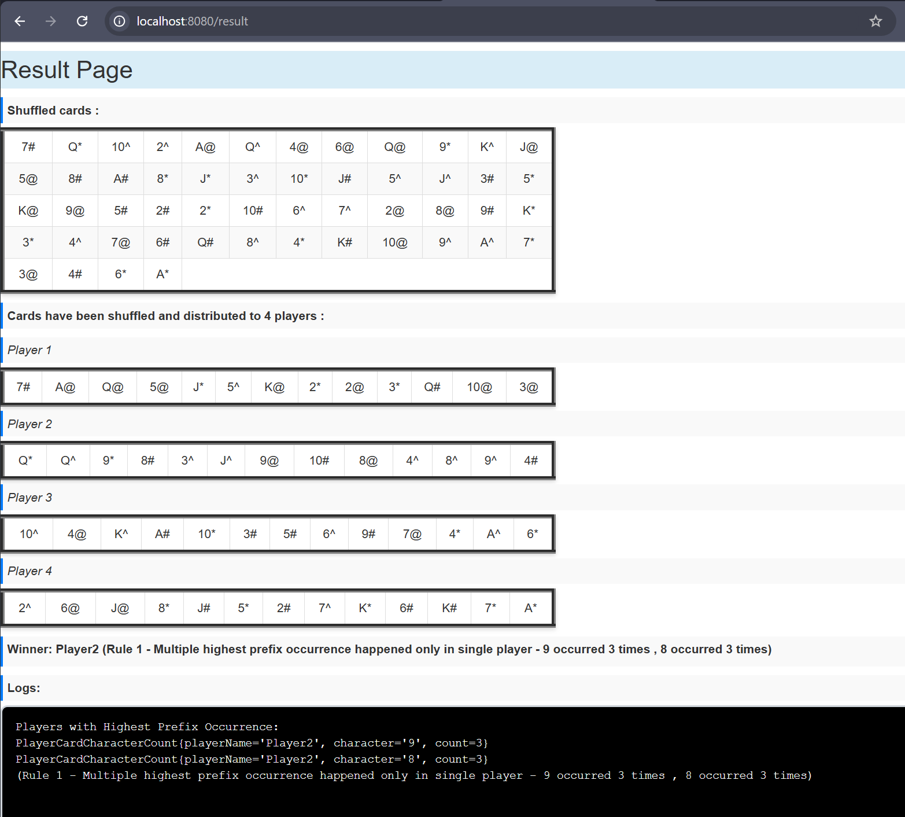

# n2n-card-game
N2N Coding Assessment - Card Game

Hi. Welcome to my project manual. Let's get started !

1. Go to home page (http://localhost:8080/home)

Description :
- This page shows cards in ASCENDING order.

2. Click 'Let's Play' button to start play

3. System will divert you to result page (http://localhost:8080/result)

Description :
- This page shows shuffled cards list.
- This page shows cards distributed to each players.
- This page shows the winner.
- This page shows the logs of the winner processing/calculation.

4. If you wish to play again, there are two options :
Option 1 : Go to home page back again (http://localhost:8080/home) and click the 'Let's Play' button
Option 2 : Reload/refresh result page (http://localhost:8080/result)